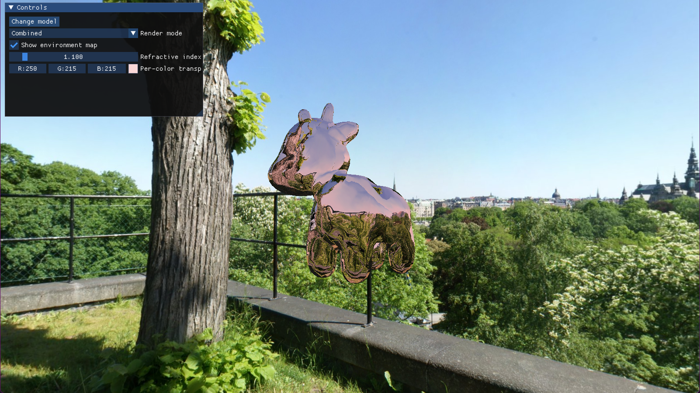

# Approximate Image-Space Interactive Refractions
Implementation of the paper [An Approximate Image-Space Approach for Interactive Refraction](https://cwyman.org/papers/sig05_approxISRefr.pdf) which proposes a technique for rendering refractions through two interfaces.

## Build Instructions
As this project uses CMake, simply use your favourite CLI/IDE/code editor and compile the `RefractionsExec` target. A compiler supporting C++20 or higher is required. All dependencies are included in this repository and compiled as needed. The textures and models utilised can be downloaded [here](https://drive.google.com/file/d/1RVpoqlr_rEpoCqh47Zfv5b-SJzNre5ZV/view?usp=sharing) (Google Drive link).

## Implementation Details
- Unlike the original paper, 3 passes are used in total. This allows front-face and back-face data to be rendered to textures for viewing
  - The first pass outputs depth, normal, and inner object distance data for front-faces
  - The second pass outputs depth, normal, and inner object distance data for back-faces
  - The third pass combines data from the previous two passes to render the final refractions. Geometry data from the rendered model is not used in this pass; it is only used to produce the relevant fragments
- A screen quad is used to render each of the 6 previous textures when desired
- A software ray-tracer is used to compute the inner object distances ($d_{\overrightarrow{N}}$ in the paper) on a per-vertex basis when a model is first loaded. A version of the mesh with these values is saved to a cache file to accelerate subsequent loads of the same model
- Additionally, the color of the medium can be changed. This attenuates the refracted light twice, once for each interface

## Libraries Used
- [GLAD](https://github.com/Dav1dde/glad)
- [GLFW3](https://www.glfw.org)
- [GLM](https://github.com/g-truc/glm)
- [ImGui](https://github.com/ocornut/imgui)
- [Native File Dialog](https://github.com/mlabbe/nativefiledialog)
- [stb](https://github.com/nothings/stb)
- [tinyobjloader](https://github.com/tinyobjloader/tinyobjloader)
- [cereal](https://uscilab.github.io/cereal/)
